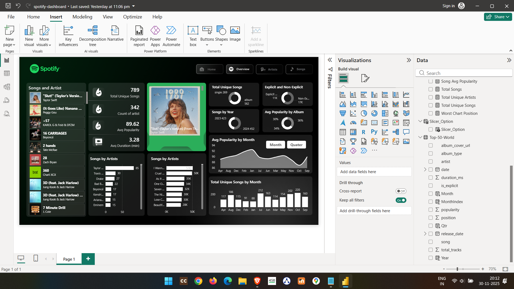

# 🎵 Spotify Analytics Dashboard

Hi there! Welcome to my **Spotify Analytics** project. 👋

I've always been curious about what makes a song climb the charts, so I decided to dive into some Spotify data using **Power BI** to see what I could find. This dashboard is the result of that exploration—it's a visual journey through top tracks, artist performance, and music trends.

## What's Inside? 🎧

Here is a breakdown of the files in this repo:

- **`spotify-dashboard.pbix`**: This is the main Power BI file where the magic happens. Feel free to open it up and play around with the visualizations!
- **`spotify-top-50-world.csv`**: The raw data I used. It contains the "Top 50" global tracks that fuel the analysis.
- **`Images/`**: A folder with some snapshots and the final report.

## The Final Report 📊

I've compiled the key insights into a final report. You can see the full dashboard below:

## What Did I Analyze? 🧐

I focused on a few key areas to get the big picture:
- **Artists**: Who is dominating the charts right now?
- **Trending**: What’s hot and rising quickly?
- **Song Characteristics**: Does the length of a song affect its popularity? (Check out the `Duration` analysis!)

I hope this gives you some cool insights into the music world. Enjoy exploring! 🚀
